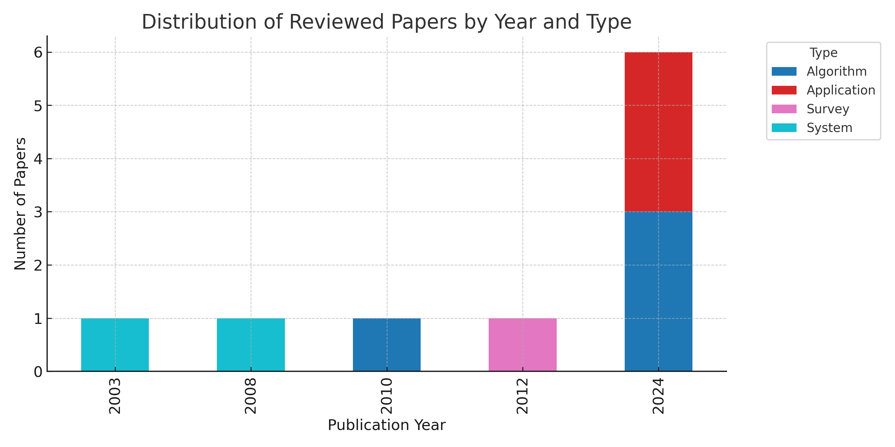
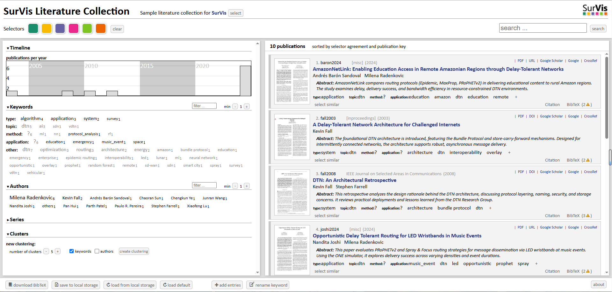

# AI in Delay-Tolerant Networking (DTN) – Literature Review (CW3)

This repository contains the literature collection and supplementary materials for the COMP4037 Coursework 3 (CW3), focusing on the application of **Artificial Intelligence (AI)** in **Delay-Tolerant Networks (DTNs)**.

## 📚 Overview

The review includes 10 academic papers that explore:

- Machine learning-based routing in DTNs
- DTN protocols for emergency, rural, and space communications
- Integration of Random Forest, Neural Networks, and SDN concepts in DTN contexts

SurVis is used to organize and explore these papers interactively.

## 🔗 Live SurVis Page

👉 [View the SurVis Literature Browser](https://axt0n0416.github.io/COMP4037cw3/src/index.html)  

## 📊 Supplementary Figures

### 📈 Figure 1: Distribution of Reviewed Papers by Year and Type

  
*Figure 1. Number of papers per year grouped by paper type (survey, algorithm, system, application).*

---

### 🖼️ Figure 2: SurVis Screenshot

  
*Figure 2. Screenshot of the interactive SurVis literature browser used to manage and visualize this review.*

---

## 📁 Repository Structure

```
.
├── bib/
│   └── references.bib            # BibTeX entries for all 10 papers
├── papers_pdf/                   # PDF files of each paper (named by bib key)
├── papers_img/                   # PNG thumbnails for SurVis (named by bib key)
├── src/                          # SurVis source files
│   ├── index.html                # Entry point for SurVis browser
│   └── data/                     # Data folder auto-generated by SurVis
├── update_data.py                # Script to regenerate SurVis data
├── publication_histogram.png     # Supplementary histogram figure
├── cw3.png                        # Screenshot of SurVis page
└── README.md                     # This file
```

---

## 🛠️ Setup Instructions

1. Clone the repository and open `src/index.html` in your browser.
2. Place PDF and PNG files using bib keys in `papers_pdf/` and `papers_img/`.
3. Run `update_data.py` to compile the data.
4. Deploy via GitHub Pages (Settings → Pages → set source to `/root` or `/docs`).

---

## 📑 License

This project is for academic coursework only and is not intended for commercial distribution.

---

**Created for COMP4037 – Research Methods @ University of Nottingham
